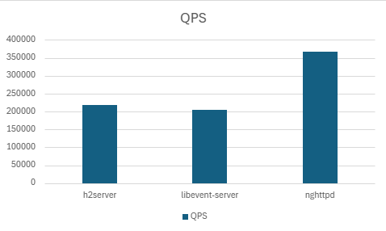
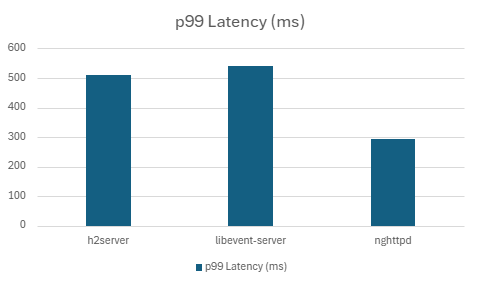
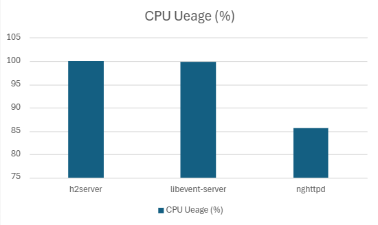
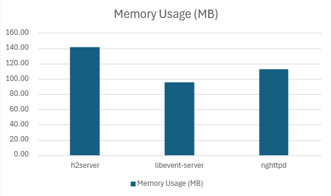
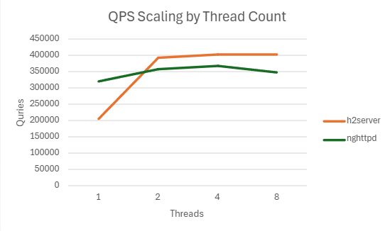
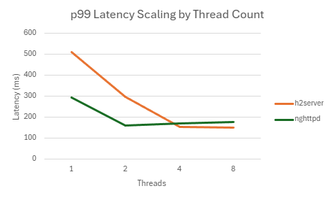
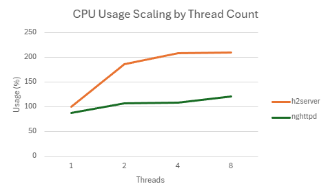
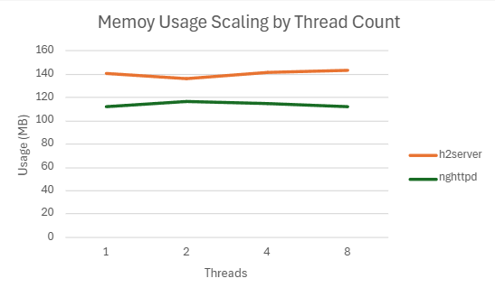

# H2 Server

**h2server** is a lightweight HTTP/2 server implemented in **`Modern C++`**.  
It runs on Linux and utilize `epoll`, [`nghttp2`](https://nghttp2.org) and [OpenSSL](https://www.openssl.org/).  
It supports optional TLS connections and delivers low-latency file services through `mmap`-based caching.  
The project was inspired by a [webserver](https://github.com/hyeonsu-choe/websvr) I previously developed in Golang, and was built as a personal initiative to study and benchmark system-level technologies such as event-driven I/O, TLS handling, and the HTTP/2 protocol.

[View full documentation](https://hyeonsu-choe.github.io/posts/h2_server/)


## 🚀 Features

- **HTTP/2 Support** using [nghttp2 v1.60.0](https://nghttp2.org)
- **TLS 1.2/1.3 support** using [OpenSSL v3.0.2](https://www.openssl.org/)
- Enable HTTP/2 Cleartext (h2c) with `--h2c` option
- Event-driven I/O model via `epoll (edge-triggered mode)`
- File caching using `mmap`
- Supports registering user-defined handler for both `GET` and `POST` Method via `Router`
- Supports uploading **multipart/from-data**


## 🛠 Tech Stack

- OS: Linux(Ubuntu 22.04)
- Language: C++17
- Networking: epoll, socket, non-blocking I/O 
- Protocol: HTTP/2([nghttp2](https://nghttp2.org)), TLS([OpenSSL](https://www.openssl.org))
- Performance: multi-threaded session management, `mmap`-based file caching 


## ⚙️ Build

```bash
git clone https://github.com/hyeonsu-choe/h2server.git
cd h2server
make -j -j$(nproc)
```

> **Note**  
> The commands above assume the project has a **Makefile at the repository root**.  
> If your `Makefile` is located under `src/`, use:
> ```bash
> cd h2server/src
> make -j$(nproc)
> ```

---

## 🐳 Build with Docker

```bash
git clone https://github.com/hyeonsu-choe/h2server.git
cd h2server
docker build -t h2-server -f ./docker_build/Dockerfile .
```

> **Note**  
> Run `docker build` **from the project root** (the directory that contains both `docker_build/` and `src/`).

---

## 🖥 Usage

### Synopsis
```bash
./h2server [OPTIONS]
```

### 📋 Options

| Flag                  | Type / Default               | Description                                                       |
|----------------------|------------------------------|-------------------------------------------------------------------|
| `-p, --port <NUM>`   | integer / `443`              | TCP port to listen on.                                            |
| `-k, --key <PATH>`   | path / `./cert/server.key`   | Path to TLS private key file. <br>Not required when using `--h2c`.   |
| `-c, --cert <PATH>`  | path / `./cert/server.crt`   | Path to TLS certificate file.<br> Not required when using `--h2c`.   |
| `-n, --threads <NUM>`| integer / `1`                | Number of worker threads.                                         |
| `--h2c`              | flag                         | Enable HTTP/2 cleartext mode (no TLS).                            |
| `-h, --help`         | flag                         | Show help and exit.                                               |

### 🐳 Run

### A) H2 over TLS, https
```bash
./h2server --port 443 --key ./cert/server.key --cert ./cert/server.crt --threads 4
```

### B) H2C over cleartext, http
```bash
./h2server --port 8080 --h2c --threads 4
```

---

## 🐳 Run with Docker

### A) Direct run
```bash
# TLS example: expose 443
docker run -d --name h2server -e RUN_MODE=h2 -e PORT=443 -e THREADS=4 -p 443:443 h2-server
```

```bash
# H2C example: expose 8080
docker run -d --name h2server-h2c -e RUN_MODE=h2c -e PORT=8080 -e THREADS=4 -p 8080:8080 h2-server
```

### B) Run with docker-compose
`docker_build/docker-compose.yml` (example)
```yaml
services:
  h2_server:
    image: h2-server
    environment:
      - RUN_MODE=h2
      - PORT=443
      - THREADS=1
    ports:
      - 0.0.0.0:443:443
      - :::443:443
```

Run:
```bash
cd docker_build
docker-compose up -d
```

### Routing & Handlers (Registering Handlers)

**Router**: The Router maps incoming HTTP/2 requests (method + path) to user-defined handlers.  
It cleanly separates I/O & protocol (nghttp2/OpenSSL/epoll) from application logic.  

- Supported methods: GET, POST
- Registration timing: Register routes only before server start (before calling listen_and_serve).

```cpp
// Example: path parameter {file_name}
server.add_handler(Method::GET,  "/files/{file_name}", downloader);
server.add_handler(Method::POST, "/files",            uploader);
```
- Path parameter: `{file_name}` in `/files/{file_name}`.  
- Matching priority:  
  - exact > parameter > wildcard.

### Handler Signature  

Handlers use the form `int handler(Request& request)`.

Example: File Downloader
```cpp
int downloader(Request& request)
{
    StreamData* stream_data = request.stream_data;
    const std::string& rel_path = request.rel_path;

    if (rel_path.empty()) {
        return request.reply_404();
    }

    auto file = load_file_from_filecache(rel_path);
    if (!file) {
        return request.reply_404();
    }

    stream_data->file_ctx.data = file->get_data();
    stream_data->file_ctx.size = file->get_data_len();

    return request.reply_ok_with_file();
}
```
Response Helpers
- `reply_ok_with_file()` - send file body with `200 OK`
- `reply_ok` - `200 OK` without body
- `reply_404` - `404 Not Found`


## 📊 Benchmark Results (via `h2load`)

> 🧪 **Benchmark Methodology**:  
> - Benchmarks were executed 5 times each and averaged.
> - Latency percentiles were calculated from TSV(Tab-Separated Values) logs exported by `h2load`.
> - CPU and memory usage were captured using `pidstat` during the 60-seconds load duration.

> 📌 **Key Findings**:
> - MMAP optimization reduced p99 latency by over 60% in both low and high concurrency settings.
> - TLS introduces moderate overhead (~20-30ms at p99), but performance remained stable.
> - Without mmap-based caching, the server opened many files concurrently during response handling, increasing the number of simultaneously open File Descriptors and eventually hitting the process limit.

### 🌐 Benchmark Environment

All benchmarks were conducted in a virtualized environment using VMware:
> - **Host OS**: Windows 11 Pro (64-bit, 24H2)
> - **Virtualization**: VMware Workstation 17 Pro
> - **Guest OS**: Ubuntu 22.04 LTS (64-bit)
> - **vCPU Configuration**: 4 processors * 2 = **8 vCPUs total**
> - **Host CPU**: AMD Ryzen 5 7500F (6-Core)
> - **Allocated Memory**: 8 GB
> - **Disk**: Virtual disk backed by NVMe SSD
> - **Network**: Host-only network via VMware virtual interface  
>   All benchmarking traffic was confined to the guest <-> guest communication layer.  
>   External Internet was not used during tests.
> - **Kernel Version**: 6.8.0
> - **Compiler**: g++ 11.4.0 (C++17)
> - **Benchmark Tools**: 
>   - `h2load`: v1.60.0 
>   - `pidstat`: v12.5.2

All benchmarks were performed using `h2load` from nghttp2:
```bash
./h2load -c<clients> -m<streams> --warm-up-time=5 -D 60 <web server addr>/index.html  
```
⚠️ **Note**: `/index.html` size is 158 byte.

### ▶️ Client-Side Test Command
```bash
./h2load -c1000 -m100 --warm-up-time=5 -D 60 https://test.com/index.html --log-file=result.tsv
```
Latency percentiles (p99, p90, p50) were calculated  from the TSV file as follows:
```bash
# p99
total=$(cut -f3 result.tsv | wc -l); p99=$(echo "$total * 0.99" | bc | cut -d. -f1); cut -f3 result.tsv | sort -n | sed -n "${p99}p"

# p90
total=$(cut -f3 result.tsv | wc -l); p90=$(echo "$total * 0.90" | bc | cut -d. -f1); cut -f3 result.tsv | sort -n | sed -n "${p90}p"

# p50
total=$(cut -f3 result.tsv | wc -l); p50=$(echo "$total * 0.50" | bc | cut -d. -f1); cut -f3 result.tsv | sort -n | sed -n "${p50}p"
```
CPU and memory usage were measured on the server using the following perf command:
```bash
pidstat -r -u -p <PID> 1 60
```


### 🏆 Server Performance Comparison

| Server | Version / Commit | QPS | Success Rate (%) | p99 Latency (ms) | p90 Latency (ms) | p50 Latency (ms)  | CPU Usage (%) | Memory Usage (MB) |
|---------------|-------------|------------|-----------|--------|-------|----------|---------|----------|
| h2server | `d5412ab` | 217159.334 | 100% | 510.0868 | 484.559 | 458.1346 | 99.846 | 140.04 |
| libevent-server | nghttp2 1.60.0 | 204798.998 |100% | 541.5324 | 507.1514 | 479.899 | 99.912 | 95.45 |
| nghttpd | nghttp2 1.60.0 | 366110.576 | 100% | 293.5366 | 213.9618 | 147.3734 | 88.154 | 112.97 |

|  |  |
|:------------------------------------:|:------------------------------------:|
| **QPS (Throughput): Higher is better**                 | **p99 Latency: Lower is better**                      |

|  |  |
|:------------------------------------:|:------------------------------------:|
| **CPU Usage**                        | **Memory Usage**                     |

⚠️ **Note**: For **libevent-server**, running `h2load` with `-c1000` and `-m100` hits resource limits during response handling when the default file descriptor limit (1024) is used, resulting in a failure rate below 20%, which prevents meaningful performance measurement. Therefore, for libevent-server we increased the file descriptor limit from the default 1,024 to 65,535 using `ulimit -n` before running the tests.

### 📈 Thread Scaling Performance
> **Test Notes**
> - **libevent-server**: Excluded from the comparison because it supports only a single thread.
> - **nghttpd**: When running with `-n 8` (8 worker threads), the default file descriptor limit (1024) caused `h2load` to hang indefinitely. For this specific test, we raised the limit to **65,535** using `ulimit -n` to complete the benchmark.
>
> Unless otherwise noted, other tests used the default file descriptor limit.

#### A. QPS
| Threads | h2server | nghttpd |
|:---------:|:----------:|:---------:|
| **1** | 217159.334 | 366110.576 |
| **2** | 389953.44 | 402464.334 |
| **4** | 426597.082 | 399435.666 |
| **8** | 423505.2 | 397154.602 |

|  |
|:------------------------------------:|
| **QPS (Throughput): Higher is better** |

#### B. p99 Latency
| Threads | h2server | nghttpd |
|:---------:|:----------:|:---------:|
| **1** | 510.0868 | 293.5366 |
| **2** | 295.7502 | 159.732 |
| **4** | 153.9212 | 169.6138 |
| **8** | 148.8116 | 176.494 |

|  |
|:------------------------------------:|
| **p99 Latency: Lower is better** |

#### C. CPU Usage
| Threads | h2server | nghttpd |
|:---------:|:----------:|:---------:|
| **1** | 99.846 | 88.154 |
| **2** | 186.524 | 107.372 |
| **4** | 208.794 | 109 |
| **8** | 210.396 | 121.392 |

|  |
|:------------------------------------:|
| **CPU Usage** |

#### D. Memory Usage
| Threads | h2server | nghttpd |
|:---------:|:----------:|:---------:|
| **1** | 140.0394531 | 112.9652344 |
| **2** | 139.2839844 | 113.3726563 |
| **4** | 128.4552734 | 113.0642578 |
| **8** | 128.0207031 | 112.834375 |

|  |
|:------------------------------------:|
| **Memory Usage** |


### ✅ Benchmark Summary
1. Throughput (QPS)
   - With a single thread, `nghttpd` achieves higher throughput (217K vs 366K).
   - With 4–8 threads, `h2server` scales more effectively and outperforms `nghttpd`.
     - h2server: 426K QPS
     - nghttpd: 402K QPS

    👉 Better scalability with h2server in multi-threaded environments.

2. p99 Latency
   - At 1–2 threads, `nghttpd` shows lower latency.
   - As threads increase, `h2server` reduces latency more effectively and maintains lower p99 latency at 4–8 threads.

    👉 h2server delivers more stable and lower tail latency under multi-threaded workloads.

3. CPU Usage
   - `h2server` utilizes CPU resources much more aggressively (e.g., 208% vs 109% at 4 threads).
   - This reflects a design tradeoff: higher CPU usage in exchange for better throughput and latency.

4. Memory Usage
   - `nghttpd` consistently shows lower memory consumption across all tests.
   - `h2server` consumes slightly more memory, but usage decreases as threads scale (from ~140MB at 1 thread to ~128MB at 8 threads).

5. Overall Interpretation  
   - h2server: Strong scalability with higher throughput and lower latency under multi-threaded conditions, at the cost of higher CPU utilization.
   - nghttpd: More efficient in single-thread performance and memory usage, but limited scalability.

   👉 In short: “nghttpd excels in single-thread efficiency, while h2server outperforms in multi-thread scalability and tail latency.”


- **Notes & test constraints:**  
  - **libevent-server** supports only a single thread and was excluded from scaling charts.  
  - With **nghttpd `-n 8`**, the default file descriptor limit (**1024**) caused `h2load` to hang; raising it to **65,535** via `ulimit -n` was required to complete the benchmark.  
  - Unless otherwise noted, other tests used the default file descriptor limit.


## 📜 License
This project is licensed under the [MIT License](./LICENSE)


## 🧑‍💻 Contact
- **Maintainer**: Hyeonsu Choi
- **Email**: [hyeonsu.choe@gmail.com](mailto:hyeonsu.choe@gmail.com)
- **GitHub**: [github.com/hyeonsu-choe](https://github.com/hyeonsu-choe) 
