# H2 Server

**h2server** is a lightweight HTTP/2 server developed from scratch using **`Modern C++`**, utilizing `epoll`, [`nghttp2`](https://nghttp2.org) and [OpenSSL](https://www.openssl.org/).  
It supports secure TLS connections and is optimized for low-latency file serving, with optional `mmap`-based caching.  
This project was originally inspired by a [websvr](https://github.com/Ursanius/websvr) I had previously built in Go.  
I developed it as a personal portfolio project to reimplement core HTTP/2 server functionality entirely in Modern C++, with the goal of studying and benchmarking system-level technologies such as event-driven I/O, TLS integration, and the HTTP/2 protocol.


## Features

- **HTTP/2 Support** using [nghttp2](https://nghttp2.org)
- **TLS 1.2/1.3 support** using [OpenSSL](https://www.openssl.org/)
- Supports HTTP/2 Cleartext (h2c) mode via `--h2c` option
- Event-driven I/O model via `epoll (edge triggered mode)`
- File caching using `mmap`
- Benchmark-ready with `h2load` support


## Tech Stack

- OS: Linux(Ubuntu)
- Language: C++11
- Networking: epoll, socket, non-blocking I/O 
- Protocol: HTTP/2([nghttp2](https://nghttp2.org)), TLS([OpenSSL](https://www.openssl.org))
- Performance: `mmap`, shared_ptr-based session management


## Build Instructions
```bash
git clone https://github.com/ursanius/h2server.git
cd h2server
make -j$(nproc)
```

## Run in HTTPS mode
```bash
./h2server --port 443 --key ./cert/server.key --cert ./cert/server.crt
```

## Run in h2c mode (HTTP/2 over cleartext)
```bash
./h2server --port 8080 --h2c
```

## Benchmark Results (via `h2load`)

> **Benchmark Methodology**:  
> - Benchmarks were executed 5 times each and averaged.
> - Latency percentiles were calculated from TSV logs exported by `h2load`.
> - CPU and memory usage were captured using `pidstat` during the 60-seconds load duration.

> **Key Findings**:
> - MMAP optimization reduced p99 latency by over 60% in both low and high concurrency settings.
> - TLS introduces moderate overhead (~20-30ms at p99), but performance remained stable.
> - Without MMAP, the server failed under high load due to file descriptor exhaustion.

### Benchmark Environment

All benchmarks were conducted in a virtualized environment using VMware:
> - **Host OS**: Windows 11 Pro (64-bit, 24H2)
> - **Virtualization**: VMware Workstation 17 Pro
> - **Guest OS**: Ubuntu 22.04 LTS (64-bit)
> - **vCPU Configuration**: 4 processors * 2 = **8 vCPUs total**
> - **Host CPU**: AMD Ryzen 5 7500F (6-Core)
> - **Allocated Memory**: 8 GB
> - **Disk**: Virtual disk backed by NVMe SSD
> - **Network**: Host-only network via VMware virtual interface  
>   All benchmarking traffic was confined to the guest <-> host communication layer.  
>   External Internet was not used during tests.
> - **Kernel Version**: 6.8.0
> - **Compiler**: g++ 11.4.0 (C++20)
> - **Benchmark Tools**: 
>   - `h2load`: v1.60.0 
>   - `pidstat`: v12.5.2
>   - `perf`: v6.8.12

All benchmarks were performed using `h2load` from nghttp2:
```bash
./h2load -c<clients> -m<streams> --warm-up-time=5 -D 60 <web server addr>/index.html  
```
_**Note**: `/index.html` size is 158 byte._
### HTTP/2 Cleartext (h2c) Test Example
```bash
./h2load -c1000 -m100 --warm-up-time=5 -D 60  http://test.com:8080/index.html --no-tls-proto=h2c
```
### HTTPS (TLS) Test Example
```bash
./h2load -c1000 -m100 --warm-up-time=5 -D 60  https://test.com/index.html
```
### Full Test with Log Output Example
```bash
./h2load -c1000 -m100 --warm-up-time=5 -D 60  https://test.com/index.html --log-file=result.tsv
```
Latency percentiles (p99, p90, p50) were calculated  from the TSV file as follows:
```bash
# p99
total=$(cut -f3 result.tsv | wc -l); p99=$(echo "$total * 0.99" | bc | cut -d. -f1); cut -f3 result.tsv | sort -n | sed -n "${p99}p"

# p90
total=$(cut -f3 result.tsv | wc -l); p90=$(echo "$total * 0.90" | bc | cut -d. -f1); cut -f3 result.tsv | sort -n | sed -n "${p90}p"

# p50
total=$(cut -f3 result.tsv | wc -l); p50=$(echo "$total * 0.50" | bc | cut -d. -f1); cut -f3 result.tsv | sort -n | sed -n "${p50}p"
```
CPU and memory usage were measured on the server using the following perf command:
```bash
perf record -p <pid> -g -- sleep 60
```
<br>

### Optimized Configuration (h2server only)

### Scenario A: Normal Concurrency (c100, m10)
| Configuration | Version / Commit | QPS        | Success Rate (%)       | p99 Latency (ms) | p90 Latency (ms) | p50 Latency (ms)  | CPU Usage (%) | Memory Usage (MB) |
|---------------|-------------|------------|-----------|--------|-------|----------|----------------|--------------------|
| without MMAP (h2c) | `9fb52ea`  | 122060.232 | 100% | 10.674 | 8.9248 | 8.0674 | 98.41 | 7.45 |
| with MMAP (h2c) | `e3b3805`   | 224543.5 |100% | 3.7808 | 2.9148 | 2.4816 | 89.63 | 20.31 |
| with MMAP + TLS | `e3b3805`   | 190543.634 | 100% | 6.327 | 4.626 | 3.074 | 92.73 | 15.85 |
   
   
| 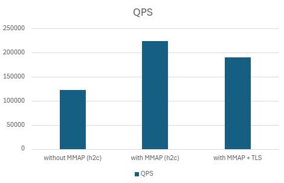 | 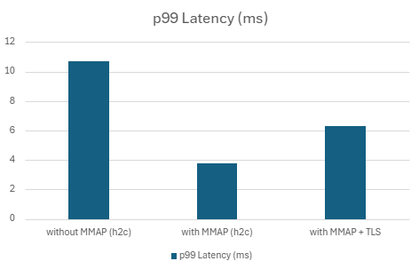 |
|:------------------------------------:|:------------------------------------:|
| **QPS (Throughput)**                 | **p99 Latency**                      |

| 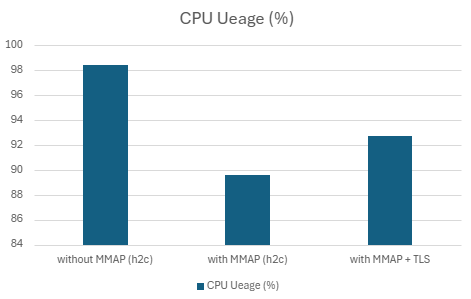 | 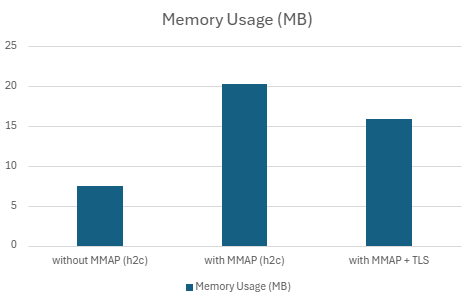 |
|:------------------------------------:|:------------------------------------:|
| **CPU Usage**                        | **Memory Usage**                     |

- MMAP usage significantly reduced latency and improved throughput.
- TLS added moderate overhead but maintained stable performance. 

<br>

### Scenario B: High Concurrency (c1000, m100)

| Configuration | Version / Commit | QPS        | Success Rate (%)       | p99 Latency (ms) | p90 Latency (ms) | p50 Latency (ms)  | CPU Usage (%) | Memory Usage (MB) |
|---------------|-------------|------------|-----------|--------|-------|----------|----------------|--------------------|
| without MMAP | `9fb52ea`  | 108745.666 | 0.1% | 968.666 | 891.9512 | 740.1804 | 85.978 | 76.84 |
| with MMAP | `e3b3805`   | 361051.334 |100% | 290.2608 | 276.253 | 270.2988 | 99.236 | 84.17 |
| with MMAP + TLS | `e3b3805`   | 340922.308| 100% | 324.6172 | 290.5728 | 277.5948 | 99.892 | 125.94 |


| 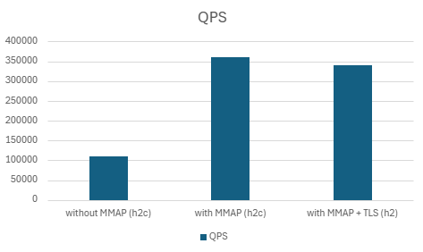 | 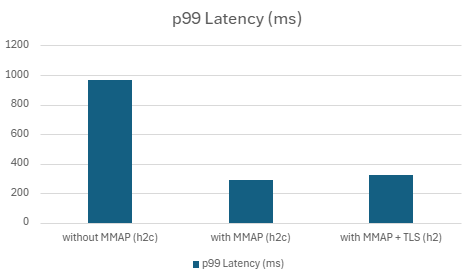 |
|:------------------------------------:|:------------------------------------:|
| **QPS (Throughput)**                 | **p99 Latency**                      |

| 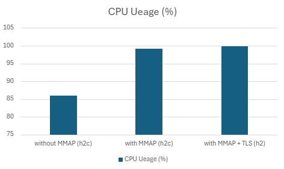 | 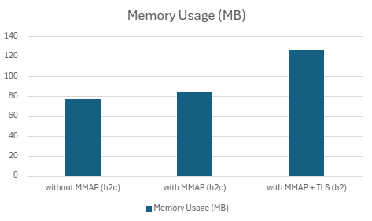 |
|:------------------------------------:|:------------------------------------:|
| **CPU Usage**                        | **Memory Usage**                     |

- File descriptor exhaustion occurred during file response generation when MMAP was not used.

<br>

### Comparative Benchmark (Reference Servers)

### Scenario A: Normal Concurrency (c100, m10)
| Server Configuration | Version / Commit | QPS        | Success Rate (%)       | p99 Latency (ms) | p90 Latency (ms) | p50 Latency (ms)  | CPU Usage (%) | Memory Usage (MB) |
|---------------|-------------|------------|-----------|--------|-------|----------|----------------|--------------------|
| h2server | `e3b3805` | 190543.634 | 100% | 6.327 | 4.626 | 3.074 | 92.728 | 15.85 |
| libevent-server | nghttp2 1.60.0 | 151187.566 |100% | 9.213 | 7.1444 | 5.2616 | 97.472 | 15.83 |
| nghttpd | nghttp2 1.60.0 | 174105.634 | 100% | 4.8704 | 3.262 | 2.7712 | 75.898 | 18.32 |


| 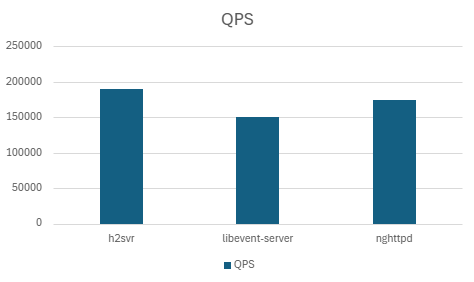 | 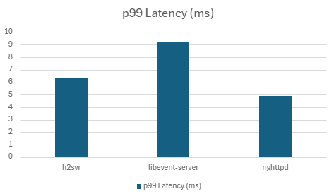 |
|:------------------------------------:|:------------------------------------:|
| **QPS (Throughput)**                 | **p99 Latency**                      |

| 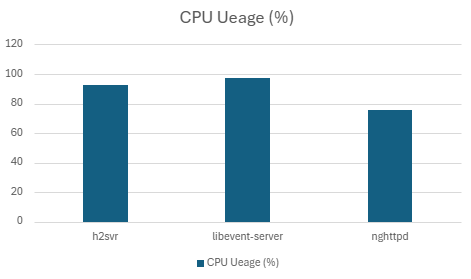 | 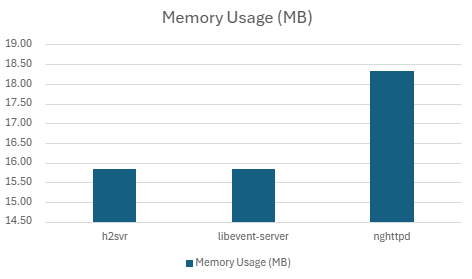 |
|:------------------------------------:|:------------------------------------:|
| **CPU Usage**                        | **Memory Usage**                     |

<br>  

### Scenario B: High Concurrency (c1000, m100)
| Server Configuration | Version / Commit | QPS | Success Rate (%) | p99 Latency (ms) | p90 Latency (ms) | p50 Latency (ms)  | CPU Usage (%) | Memory Usage (MB) |
|---------------|-------------|------------|-----------|--------|-------|----------|---------|----------|
| h2server | `e3b3805` | 340922.308 | 100% | 324.6172 | 290.5728 | 277.5948 | 99.892 | 125.94 |
| libevent-server | nghttp2 1.60.0 | 9704.562 |17.01% | 1897.7302 | 1785.6954 | 1722.412 | 72.792 | 89.06 |
| nghttpd | nghttp2 1.60.0 | 368260.894 | 100% | 243.688 | 148.7488 | 137.2834 | 83.338 | 112.71 |


| 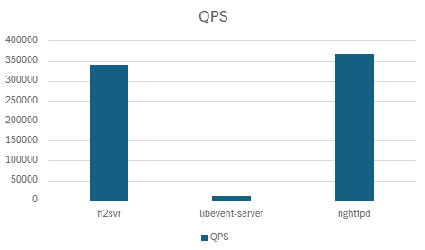 | 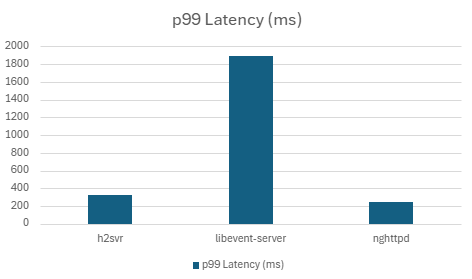 |
|:------------------------------------:|:------------------------------------:|
| **QPS (Throughput)**                 | **p99 Latency**                      |

| 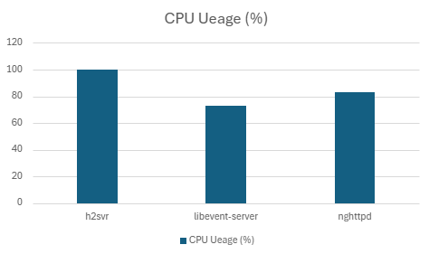 | 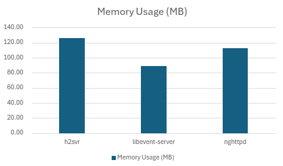 |
|:------------------------------------:|:------------------------------------:|
| **CPU Usage**                        | **Memory Usage**                     |

- File descriptor exhaustion occurred during file response generation in libevent-server.

<br>

### Performance Summary
In both normal and high-concurrency scenarios, `h2server` consistently demonstrated:
- Over 2× higher throughput compared to libevent-based servers (QPS)
- Lower p99 latency under identical load
- Stable CPU and memory usage under TLS
- No failure under high concurrent file downloads (unlike libevent-server)


## License
This project is licensed under the [MIT License](./LICENSE)


## Contact
- **Maintainer**: Hyeonsu Choi
- **Email**: [ursanius@gmail.com](mailto:ursanius@gmail.com)
- **GitHub**: [github.com/Ursanius](https://github.com/Ursanius) 